## Vesc Ninebot G3 Max
<p align="center">
  <strong>Open controller integration for the Segway Ninebot MAX G3.</strong><br>
  Preserve the factory dashboard, decode the vehicle protocol, and bridge it to VESC — safely.
</p>

<p align="center">
  
  
  
  
</p>

---

## Overview

**MAX G3 VESC Bridge** is a hardware and firmware starting point for replacing the stock motor controller in a Segway Ninebot MAX G3 while retaining the original dashboard and controls.

The project combines an **Arduino Nano ESP32 dashboard bridge** with a **VESC LispBM endpoint**. The current release is intentionally a discovery build: it captures dashboard traffic, validates candidate Ninebot frames, and proves the ESP32-to-VESC I2C link without allowing motor current.

> [!IMPORTANT]
> This is a bench-development project, not ride-ready firmware. The MAX G3 dashboard protocol, connector voltages, motor parameters, BMS behaviour, Hall order, and safe current limits must be measured on real hardware before drive output is enabled.

## Project status

| Area | Status | Notes |
|---|:---:|---|
| Dashboard UART capture | **Ready** | Receive-only capture prevents bus contention with the stock controller |
| Legacy Ninebot checksum decoder | **Ready** | Detects `5A A5` candidate frames and labels valid or invalid checksums |
| ESP32 ↔ VESC I2C link | **Ready** | Fixed address `0x45`, compatible with the supplied G2 bridge architecture |
| Capture analysis tool | **Ready** | PowerShell report groups frames by source, destination, command, and length |
| MAX G3 packet map | **Pending capture** | G2 byte positions are treated only as unverified candidates |
| Dashboard status replies | **Not enabled** | Requires controller-to-dashboard captures from a real MAX G3 |
| Motor control | **Safety locked** | ESP32 sends zero controls and the LispBM script holds zero current |
| Road use | **Not ready** | Requires completed protocol, electrical, motor, brake, and thermal validation |

## How it fits together

```mermaid
flowchart LR
    DASH["MAX G3 dashboard<br/>throttle · brake · controls"]
    LEVEL["Measured logic-level<br/>interface"]
    ESP["Arduino Nano ESP32<br/>capture · decode · failsafe"]
    VESC["VESC<br/>LispBM · telemetry · motor control"]
    MOTOR["MAX G3 motor<br/>Hall · phase · temperature"]

    DASH <-->|"dashboard bus"| LEVEL
    LEVEL <-->|"UART — unverified"| ESP
    ESP <-->|"I2C 0x45"| VESC
    VESC -. "locked in this build" .-> MOTOR

    classDef dash fill:#122033,stroke:#38BDF8,color:#EAF7FF,stroke-width:2px;
    classDef bridge fill:#162A2A,stroke:#2DD4BF,color:#ECFEFF,stroke-width:2px;
    classDef controller fill:#281B3D,stroke:#A78BFA,color:#F5F3FF,stroke-width:2px;
    classDef locked fill:#321D1D,stroke:#FB7185,color:#FFF1F2,stroke-width:2px;
    class DASH dash;
    class LEVEL,ESP bridge;
    class VESC controller;
    class MOTOR locked;
```



The stock controller remains connected during the first capture stage. The Nano ESP32 listens through a correctly selected level shifter and never drives the dashboard line.

## Safety model

This repository uses multiple independent barriers so an incomplete protocol guess cannot become a throttle command.

| Barrier | Default | Purpose |
|---|---:|---|
| Dashboard TX pin | `-1` / disabled | Prevents the ESP32 from fighting the stock controller on the bus |
| `kG3ProtocolVerified` | `false` | Rejects candidate throttle and brake bytes until the packet map is proven |
| `kAllowDriveOutput` | `false` | Separate human-controlled permission gate for motor commands |
| Input timeout | `80 ms` | Invalidates stale controls if communication stops |
| LispBM current command | `0.0` | Keeps VESC motor current at zero throughout bench discovery |
| LispBM app output | disabled | Prevents another configured VESC input app from taking control |

> [!CAUTION]
> Never bypass both software gates to “see if it works.” A wrong byte offset can interpret battery level, mode, or packet noise as full throttle.

## Hardware

| Component | Requirement |
|---|---|
| Scooter | Segway Ninebot MAX G3 — exact region, model code, and model year must be recorded |
| Bridge MCU | Arduino Nano ESP32 |
| Motor controller | VESC with safe voltage margin above the battery’s maximum charged voltage |
| Signal interface | Bidirectional or receive-only level shifting selected from measured bus voltage |
| Test equipment | Multimeter plus oscilloscope or logic analyser |
| Bench power | Fused, current-limited supply recommended for initial bring-up |
| Mechanical safety | Traction motor disconnected or driven wheel securely raised |

The original MAX G2 prototype photo is **not** a MAX G3 wiring diagram. Wire colour is not a reliable pinout.

## Repository layout

```text
VESC-Ninebot-Max-G3/
├── docs/
│   └── header.svg                 Project artwork
├── firmware/
│   └── G3VescBridge/
│       ├── BridgeConfig.h         Pins, safety gates, and candidate frame map
│       ├── BridgeProtocol.h       Frame checksum and I2C helpers
│       └── G3VescBridge.ino       Receive-only dashboard capture firmware
├── tools/
│   └── Decode-G3Capture.ps1       Capture summary utility
├── vesc/
│   └── G3VescBench.lisp           Zero-output VESC bench endpoint
├── platformio.ini                 Nano ESP32 PlatformIO environment
└── README.md
```

## Bench quick start

### 1. Record the scooter

Before disconnecting anything, record:

- region and complete model code;
- model year and firmware versions;
- battery label, nominal voltage, and BMS current limits;
- controller, dashboard, motor, and connector part numbers;
- clear photos of every connector from both sides.

### 2. Measure before connecting

With the stock controller installed, measure every candidate dashboard wire relative to ground in the following states:

| State | What to record |
|---|---|
| Powered off | Resting voltage on every pin |
| Powered on / idle | Supply rails, data-line idle level, and button line |
| Button press | Voltage transition and duration |
| Throttle sweep | Minimum, midpoint, and maximum behaviour |
| Brake sweep | Minimum, midpoint, and maximum behaviour |

Identify signal direction, idle voltage, and baud rate with a scope or logic analyser. Do not connect an unknown scooter signal directly to an ESP32 pin.

### 3. Flash the discovery bridge

Open this project in PlatformIO and upload the default environment:

```powershell
pio run --target upload
pio device monitor --baud 115200
```

The serial monitor should begin with:

```text
ms,direction,checksum,length,hex
MAX G3 discovery bridge ready; motor output is DISABLED
```

### 4. Capture one action at a time

Connect only Nano `D4` through the verified level interface to the data direction being observed. Keep the stock controller connected. Save separate, clearly named logs:

| Capture | Action |
|---|---|
| `g3-idle.txt` | Power on and leave every control untouched |
| `g3-throttle.txt` | Slowly sweep throttle from zero to full and back |
| `g3-brake.txt` | Slowly sweep the brake control from zero to full and back |
| `g3-modes.txt` | Cycle Eco, Drive, and Sport individually |
| `g3-lights.txt` | Toggle headlight, indicators, horn, and brake light separately |
| `g3-power-lock.txt` | Short press, long press, lock, and unlock separately |

Use a logic analyser for simultaneous bidirectional capture. If using the Nano as a one-channel listener, move RX between directions only while powered down and label each log accordingly.

### 5. Decode a capture

```powershell
.\tools\Decode-G3Capture.ps1 -Path .\captures\g3-throttle.txt
```

Example report shape:

```text
Count Source Target Command Length Sample
----- ------ ------ ------- ------ ------
  248 0x21   0x20   0x64        17 00 24 27 40 ...
```

Repeated frames can then be compared across isolated actions to identify changing bytes without guessing.

## VESC bench check

Load [`vesc/G3VescBench.lisp`](vesc/G3VescBench.lisp) through VESC Tool. The script exposes live variables for validating the bridge:

| Variable | Meaning |
|---|---|
| `vt-good-rx` | Valid ESP32 I2C frames received |
| `vt-bad-rx` | Frames rejected by checksum validation |
| `vt-throttle-raw` | Candidate raw throttle byte — observation only |
| `vt-brake-raw` | Candidate raw brake byte — observation only |
| `vt-output-disabled` | Output-disable state received from the ESP32 |

Motor current remains set to zero. This stage proves communication only.

## MAX G3 platform notes

Public MAX G3 specifications list the following baseline values. They are useful for controller selection, but they are **not** a substitute for the battery label, BMS limits, or VESC motor detection on the actual scooter.

| Specification | Published value |
|---|---:|
| Battery nominal voltage | 46.8 V |
| Battery maximum charge voltage | 54.6 V |
| Battery energy | 597 Wh |
| Motor nominal power | 850 W |
| Motor maximum power | 2,000 W |
| Tyre size | 11 inch |

Any selected VESC needs appropriate voltage margin above the maximum charged battery voltage, plus current and thermal capability suited to the measured system.

## What is needed for a ride-ready port

- [ ] Exact scooter region, model code, model year, and firmware versions
- [ ] Dashboard connector pinout with measured voltages
- [ ] Labelled dashboard-to-controller and controller-to-dashboard captures
- [ ] Confirmed throttle, brake, button, horn, light, indicator, and mode fields
- [ ] Confirmed dashboard status-reply format and timing
- [ ] VESC make, model, hardware revision, and firmware version
- [ ] Battery and BMS continuous, peak, charge, and regenerative-current limits
- [ ] VESC motor-detection export and Hall table
- [ ] Motor temperature-sensor type and verified thermal thresholds
- [ ] Brake-priority, stale-input, disconnect, and watchdog bench tests
- [ ] Wheel-off-ground integration test followed by low-power closed-course testing

Only after every relevant item is measured and reviewed should the two output gates in [`BridgeConfig.h`](firmware/G3VescBridge/BridgeConfig.h) be considered. They are deliberately separate.

## References

- [Segway — MAX G3 product page](https://www.segway.com/ekickscooter/products/max-g3.html)
- [Segway — MAX G3 user manual](https://store.segway.com/media/wysiwyg/warranty/Max_G3_User_Manual.pdf)
- [Legacy Ninebot UART protocol notes](https://github-wiki-see.page/m/etransport/ninebot-docs/wiki/protocol) — background only; not evidence of MAX G3 compatibility
- [VESC Tool source repository](https://github.com/vedderb/vesc_tool)

## Disclaimer

This project is experimental and unaffiliated with Segway-Ninebot or the VESC Project. Modifying a traction controller can cause equipment damage, fire, loss of braking, unexpected acceleration, serious injury, and loss of warranty or road legality. Validate the electrical system and local requirements before use. You are responsible for any hardware you build, flash, or operate.

